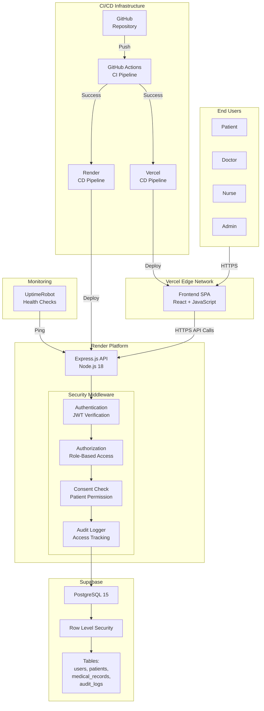
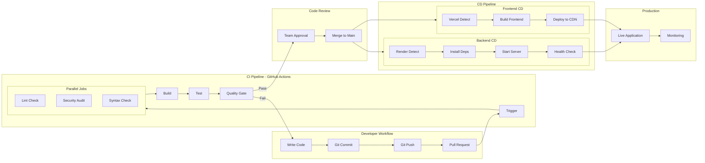
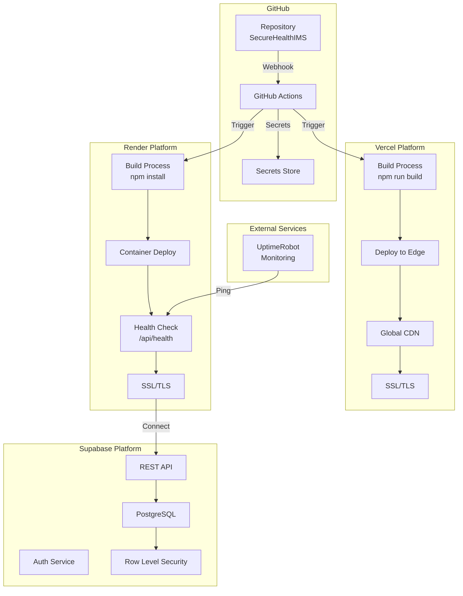
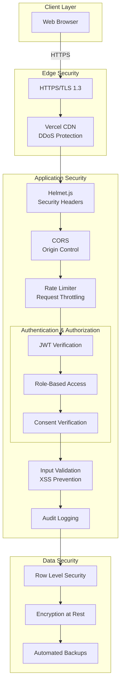
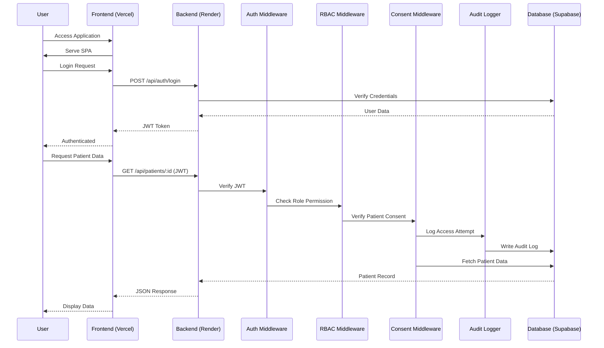
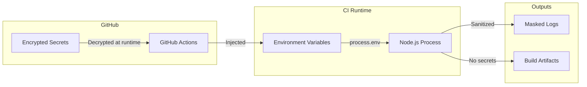
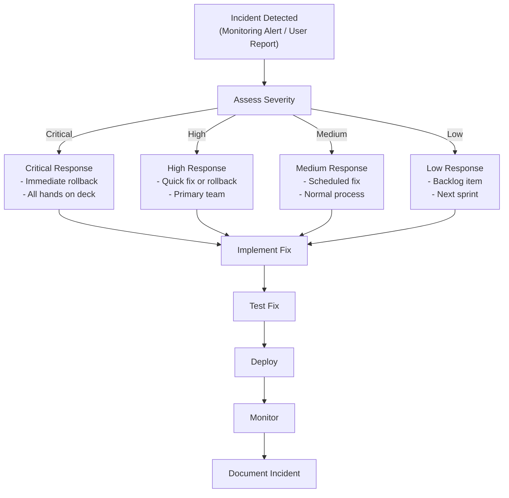

# SecureHealthIMS DevOps Architecture & Strategy

## Comprehensive DevOps Strategy Document

| Document Metadata | |
|-------------------|-----------------|
| **Project** | SecureHealthIMS |
| **Version** | 1.1.0 |
| **Date** | February 11, 2026 |
| **Classification** | Academic / Professional |
| **Author** | DevOps Architecture Team |
| **GitHub** | https://github.com/avkbsurya119 |

---

## Table of Contents

1. [Executive Summary](#1-executive-summary)
2. [Project Component Inventory](#2-project-component-inventory)
3. [Component Analysis & Deployment Mapping](#3-component-analysis--deployment-mapping)
4. [CI/CD Architecture](#4-cicd-architecture)
5. [Quality Gates & Testing Strategy](#5-quality-gates--testing-strategy)
6. [Tools & Platforms Inventory](#6-tools--platforms-inventory)
7. [Architecture Diagrams](#7-architecture-diagrams)
8. [Environment Strategy](#8-environment-strategy)
9. [Security in DevOps](#9-security-in-devops)
10. [Monitoring & Observability](#10-monitoring--observability)
11. [Disaster Recovery & Rollback](#11-disaster-recovery--rollback)
12. [Assumptions & Decisions](#12-assumptions--decisions)
13. [Appendices](#13-appendices)

---

## 1. Executive Summary

### 1.1 Project Overview

SecureHealthIMS is a full-stack healthcare information management system consisting of:

- **Frontend Application**: React 19 + JavaScript + Vite single-page application
- **Backend API Service**: Node.js 18+ Express.js REST API
- **Database Layer**: Supabase-managed PostgreSQL with Row Level Security
- **Infrastructure Scripts**: Database migrations, seeding, and administrative utilities

### 1.2 DevOps Objectives

| Objective | Description | Priority |
|-----------|-------------|----------|
| **Automation** | Automate build, test, and deployment pipelines | Critical |
| **Quality Assurance** | Enforce quality gates before any deployment | Critical |
| **Security** | Integrate security checks into CI/CD | Critical |
| **Reliability** | Ensure consistent, repeatable deployments | High |
| **Observability** | Monitor application health and performance | Medium |
| **Cost Efficiency** | Utilize free-tier services appropriately | Medium |

### 1.3 Deployment Topology

| Component | Platform | Tier | Region |
|-----------|----------|------|--------|
| Frontend | Vercel | Free | Auto (Edge) |
| Backend | Render | Free | Oregon, USA |
| Database | Supabase | Free | Auto |
| CI/CD | GitHub Actions | Free | GitHub-hosted |
| Monitoring | UptimeRobot | Free | Global |

---

## 2. Project Component Inventory

### 2.1 Complete Component Map

| Component ID | Component Name | Type | Source Location | Deployable |
|--------------|----------------|------|-----------------|------------|
| **FE-001** | Frontend SPA | Application | `SecureHealthIMS_frontend/` | Yes |
| **BE-001** | Backend API | Application | `SecureHealthIMS_backend/` | Yes |
| **DB-001** | Database Schema | Infrastructure | `SecureHealthIMS_backend/database/` | Yes (Manual) |
| **DB-002** | Database Migrations | Infrastructure | `SecureHealthIMS_backend/database/migrations/` | Yes (Manual) |
| **DB-003** | Seed Data | Infrastructure | `SecureHealthIMS_backend/database/seed*.sql` | Yes (Manual) |
| **SC-001** | Admin Scripts | Utility | `SecureHealthIMS_backend/scripts/` | No (Dev Only) |
| **SC-002** | Test Scripts | Utility | `SecureHealthIMS_backend/tests` | No (CI Only) |
| **CF-001** | ESLint Config | Configuration | `SecureHealthIMS_frontend/eslint.config.js` | No |
| **CF-002** | Vite Config | Configuration | `SecureHealthIMS_frontend/vite.config.js` | No |
| **DOC-001** | API Documentation | Documentation | `SecureHealthIMS_backend/API_DOCUMENTATION.md` | No |
| **DOC-002** | Deployment Guide | Documentation | `DEPLOYMENT_GUIDE.md` | No |

### 2.2 Frontend Component Breakdown

```
SecureHealthIMS_frontend/
├── src/
│   ├── api/                 # Axios API configuration
│   ├── assets/              # Static assets (images, svg)
│   ├── components/          # Reusable UI components
│   ├── context/             # React context providers
│   ├── pages/               # Route-based page components
│   ├── App.jsx              # Root component
│   └── main.jsx             # Entry point
├── public/                  # Static assets in public folder
├── index.html               # HTML template
└── Configuration Files
    ├── package.json
    ├── vite.config.js
    └── eslint.config.js
```

### 2.3 Backend Component Breakdown

```
SecureHealthIMS_backend/
├── src/
│   ├── config/              # Configuration (Supabase client)
│   │   └── supabaseClient.js
│   ├── controllers/         # Request handlers
│   ├── middleware/          # Express middleware
│   │   ├── auth.middleware.js
│   │   ├── rbac.middleware.js
│   │   ├── consent.middleware.js
│   │   ├── audit.middleware.js
│   │   ├── validation.middleware.js
│   │   ├── rateLimit.middleware.js
│   │   └── errorHandler.middleware.js
│   ├── routes/              # API route definitions
│   ├── services/            # Business logic
│   ├── utils/               # Utilities
│   ├── app.js               # Express app setup
│   └── server.js            # Server entry point
├── database/
│   ├── schema.sql           # Main schema
│   ├── migrations/          # Schema migrations
│   ├── seed.sql             # Base seed data
│   ├── seed_demo_accounts.sql
│   └── fix_schema.sql       # Schema patches
├── scripts/                 # Administrative scripts
│   ├── create-demo-accounts.js
│   ├── db_test.js
│   ├── migrate_admin.js
│   ├── seed_admin.js
│   ├── test_admin_flow.js
│   └── verify_jwt_login.js
└── package.json
```

### 2.4 Release Artifacts

| Artifact | Source | Build Output | Destination |
|----------|--------|--------------|-------------|
| Frontend Bundle | `SecureHealthIMS_frontend/src/` | `dist/` (static files) | Vercel CDN |
| Backend Service | `SecureHealthIMS_backend/src/` | Node.js runtime | Render Container |
| Database Schema | `database/*.sql` | SQL statements | Supabase PostgreSQL |

---

## 3. Component Analysis & Deployment Mapping

### 3.1 Frontend Application (FE-001)

| Attribute | Value |
|-----------|-------|
| **Repository** | `SecureHealthIMS_frontend/` |
| **Language** | JavaScript |
| **Framework** | React 19.2.0 |
| **Build Tool** | Vite 7.3.1 |
| **Package Manager** | npm |
| **Deployment Target** | Vercel (Static Hosting + Edge Functions) |
| **Build Command** | `npm run build` |
| **Output Directory** | `dist/` |
| **Node Version** | 18.x or higher |

#### 3.1.1 Dependencies Analysis

**Production Dependencies:**
| Package | Version | Purpose |
|---------|---------|---------|
| react | 19.2.0 | UI framework |
| react-dom | 19.2.0 | DOM rendering |
| react-router-dom | 7.13.0 | Client-side routing |
| axios | 1.13.5 | HTTP Client |
| lucide-react | 0.563.0 | Icon library |
| framer-motion | 12.34.0 | Animation library |
| clsx | 2.1.1 | Conditional classnames utility |

**Development Dependencies:**
| Package | Version | Purpose |
|---------|---------|---------|
| eslint | 9.39.1 | Code linting |
| vite | 7.3.1 | Build tooling |
| @vitejs/plugin-react | 5.1.1 | React plugin for Vite |

#### 3.1.2 Pre-Deployment Validation Requirements

| Check | Tool | Command | Failure Action |
|-------|------|---------|----------------|
| Linting | ESLint | `npm run lint` | Block deployment |
| Build Verification | Vite | `npm run build` | Block deployment |
| Unit Tests | Vitest  | `npm test` | Block deployment |
| Bundle Size | Vite | Build output analysis | Warning |

### 3.2 Backend API Service (BE-001)

| Attribute | Value |
|-----------|-------|
| **Repository** | `SecureHealthIMS_backend/` |
| **Language** | JavaScript (ES Modules) |
| **Framework** | Express.js 4.22.1 |
| **Runtime** | Node.js 18+ |
| **Package Manager** | npm |
| **Deployment Target** | Render (Web Service) |
| **Build Command** | `npm install` |
| **Start Command** | `npm start` |

#### 3.2.1 Dependencies Analysis

**Production Dependencies:**
| Package | Version | Purpose | Security Relevance |
|---------|---------|---------|-------------------|
| express | 4.22.1 | Web framework | Core |
| @supabase/supabase-js | 2.90.1 | Database client | Data access |
| jsonwebtoken | 9.0.3 | JWT handling | Authentication |
| helmet | 8.1.0 | Security headers | Critical |
| cors | 2.8.5 | CORS handling | Security |
| express-rate-limit | 8.2.1 | Rate limiting | Security |
| dotenv | 16.6.1 | Environment config | Configuration |
| postgres | 3.4.8 | PostgreSQL client | Data access |

**Development Dependencies:**
| Package | Version | Purpose |
|---------|---------|---------|
| nodemon | 3.1.11 | Development hot-reload |

#### 3.2.2 Middleware Security Pipeline

The application employs a defense-in-depth strategy using a combination of global and route-specific middleware.

**Global Middleware (in `app.js`):**
1. **Helmet**: Sets crucial security headers (CSP, HSTS, X-Frame-Options, etc.)
2. **CORS**: Enforces the cross-origin policy restricting access to authorized domains
3. **Body Parsers**: Parses incoming JSON and URL-encoded payloads
4. **Rate Limiters**: Applied globally to API routers to prevent abuse and DDoS attacks

**Route-Specific Security Middleware:**
This middleware chain is applied to protected routes to ensure granular control over authentication, authorization, and data access.

```
Request → Global Middleware → [Authenticate → Authorize (RBAC) → Validate → Check Consent → Audit] → Controller → Response
```

| Middleware | File | Purpose | Order |
|------------|------|---------|-------|
| `authenticate` | `auth.middleware.js` | JWT verification | 1 |
| `require<Role>` | `rbac.middleware.js` | Role-based access control | 2 |
| `validate` | `validation.middleware.js` | Input validation & sanitization | 3 |
| `require<Resource>Consent` | `consent.middleware.js` | Patient consent verification | 4 |
| `auditLog` | `audit.middleware.js` | Access logging for compliance | 5 |
| `errorHandler` | `errorHandler.middleware.js` | Centralized error responses | Last |

#### 3.2.3 Pre-Deployment Validation Requirements

| Check | Tool | Command | Failure Action |
|-------|------|---------|----------------|
| Dependency Install | npm | `npm install` | Block deployment |
| Syntax Check | Node.js | `node --check src/server.js` | Block deployment |
| Linting | ESLint  | `npm run lint` | Block deployment |
| Unit Tests | Jest  | `npm test` | Block deployment |
| Security Audit | npm audit | `npm audit --production` | Warning/Block |
| Health Check | HTTP | `GET /api/health` | Block traffic |

### 3.3 Database Layer (DB-001, DB-002, DB-003)

| Attribute | Value |
|-----------|-------|
| **Platform** | Supabase |
| **Engine** | PostgreSQL 15 |
| **Schema Location** | `SecureHealthIMS_backend/database/schema.sql` |
| **Migrations** | `SecureHealthIMS_backend/database/migrations/` |
| **Seed Data** | `SecureHealthIMS_backend/database/seed*.sql` |
| **Deployment Method** | Manual (Supabase SQL Editor) |

#### 3.3.1 Database Objects

| Object Type | Count | Examples |
|-------------|-------|----------|
| Tables | 8+ | users, patients, medical_records, appointments, patient_consents, consent_history, audit_logs |
| Functions | 3+ | has_patient_consent(), log_audit_event(), update_updated_at_column() |
| Triggers | 4+ | Audit logging, timestamp updates, consent history |
| Policies | Multiple | Row Level Security policies |
| Indexes | Multiple | Performance optimization |

#### 3.3.2 Migration Strategy

| Phase | Action | Tool | Validation |
|-------|--------|------|------------|
| Development | Apply migrations locally | Supabase CLI | Manual testing |
| Staging | N/A (free tier limitation) | - | - |
| Production | Apply via SQL Editor | Supabase Dashboard | Post-migration tests |
| Rollback | Execute rollback scripts | Supabase Dashboard | Data integrity check |

### 3.4 Administrative Scripts (SC-001, SC-002)

| Script | Purpose | Execution Context | Automated |
|--------|---------|-------------------|-----------|
| `create-demo-accounts.js` | Create test users | Development | No |
| `db_test.js` | Database connectivity test | CI/CD | Yes |
| `migrate_admin.js` | Admin user migration | Deployment | Manual |
| `seed_admin.js` | Seed admin user | Deployment | Manual |
| `test_admin_flow.js` | Integration test | CI/CD | Yes |
| `verify_jwt_login.js` | Auth verification test | CI/CD | Yes |

---

## 4. CI/CD Architecture

### 4.1 Pipeline Overview

The CI/CD pipeline follows a trunk-based development model with the following workflow:

```
Developer → Feature Branch → Pull Request → CI Checks → Code Review → Merge → CD Deploy → Production
```

### 4.2 Branching Strategy

| Branch Type | Pattern | Purpose | CI Trigger | CD Trigger |
|-------------|---------|---------|------------|------------|
| Main | `main` | Production-ready code | Yes | Yes (Auto-deploy) |
| Feature | `feature/*` | New features | Yes (PR) | No |
| Bugfix | `fix/*` | Bug fixes | Yes (PR) | No |
| Hotfix | `hotfix/*` | Emergency fixes | Yes (PR) | No |
| Release | `release/*` | Release preparation | Yes | Manual |

### 4.3 CI Pipeline Stages

#### 4.3.1 Frontend CI Pipeline

```yaml
# Proposed: .github/workflows/frontend-ci.yml
name: Frontend CI

on:
  push:
    branches: [main]
    paths:
      - 'SecureHealthIMS_frontend/**'
  pull_request:
    branches: [main]
    paths:
      - 'SecureHealthIMS_frontend/**'

jobs:
  lint:
    runs-on: ubuntu-latest
    steps:
      - uses: actions/checkout@v4
      - uses: actions/setup-node@v4
        with:
          node-version: '18'
          cache: 'npm'
          cache-dependency-path: SecureHealthIMS_frontend/package-lock.json
      - run: cd SecureHealthIMS_frontend && npm ci
      - run: cd SecureHealthIMS_frontend && npm run lint

  build:
    runs-on: ubuntu-latest
    needs: [lint]
    steps:
      - uses: actions/checkout@v4
      - uses: actions/setup-node@v4
        with:
          node-version: '18'
          cache: 'npm'
          cache-dependency-path: SecureHealthIMS_frontend/package-lock.json
      - run: cd SecureHealthIMS_frontend && npm ci
      - run: cd SecureHealthIMS_frontend && npm run build
      - uses: actions/upload-artifact@v4
        with:
          name: frontend-build
          path: SecureHealthIMS_frontend/dist/

  test:
    runs-on: ubuntu-latest
    needs: [lint]
    steps:
      - uses: actions/checkout@v4
      - uses: actions/setup-node@v4
        with:
          node-version: '18'
      - run: cd SecureHealthIMS_frontend && npm ci
      - run: cd SecureHealthIMS_frontend && npm test -- --coverage
        continue-on-error: true  # Until tests are implemented
```

#### 4.3.2 Backend CI Pipeline

```yaml
# Proposed: .github/workflows/backend-ci.yml
name: Backend CI

on:
  push:
    branches: [main]
    paths:
      - 'SecureHealthIMS_backend/**'
  pull_request:
    branches: [main]
    paths:
      - 'SecureHealthIMS_backend/**'

jobs:
  security-audit:
    runs-on: ubuntu-latest
    steps:
      - uses: actions/checkout@v4
      - uses: actions/setup-node@v4
        with:
          node-version: '18'
      - run: cd SecureHealthIMS_backend && npm ci
      - run: cd SecureHealthIMS_backend && npm audit --production

  syntax-check:
    runs-on: ubuntu-latest
    steps:
      - uses: actions/checkout@v4
      - uses: actions/setup-node@v4
        with:
          node-version: '18'
      - run: cd SecureHealthIMS_backend && npm ci
      - run: node --check SecureHealthIMS_backend/src/server.js
      - run: node --check SecureHealthIMS_backend/src/app.js

  integration-test:
    runs-on: ubuntu-latest
    needs: [syntax-check]
    steps:
      - uses: actions/checkout@v4
      - uses: actions/setup-node@v4
        with:
          node-version: '18'
      - run: cd SecureHealthIMS_backend && npm ci
      - run: cd SecureHealthIMS_backend && node scripts/db_test.js
        env:
          SUPABASE_URL: ${{ secrets.SUPABASE_URL }}
          SUPABASE_SERVICE_ROLE_KEY: ${{ secrets.SUPABASE_SERVICE_ROLE_KEY }}
        continue-on-error: true
```

### 4.4 CD Pipeline (Deployment)

#### 4.4.1 Frontend CD (Vercel)

| Stage | Trigger | Action | Validation |
|-------|---------|--------|------------|
| Preview | Pull Request | Deploy preview branch | Automatic preview URL |
| Production | Merge to main | Deploy to production | Health check |
| Rollback | Manual | Promote previous deployment | Verification |

**Vercel Configuration (vercel.json - proposed):**
```json
{
  "buildCommand": "cd SecureHealthIMS_frontend && npm run build",
  "outputDirectory": "SecureHealthIMS_frontend/dist",
  "framework": "vite",
  "github": {
    "silent": true
  }
}
```

#### 4.4.2 Backend CD (Render)

| Stage | Trigger | Action | Validation |
|-------|---------|--------|------------|
| Build | Push to main | `npm install` | Exit code 0 |
| Deploy | Build success | `npm start` | Process starts |
| Health | Post-deploy | `GET /api/health` | 200 OK |
| Rollback | Manual | Deploy previous commit | Health check |

**Render Configuration (render.yaml - proposed):**
```yaml
services:
  - type: web
    name: securehealthims-backend
    env: node
    region: oregon
    plan: free
    branch: main
    rootDir: SecureHealthIMS_backend
    buildCommand: npm install
    startCommand: npm start
    healthCheckPath: /api/health
    envVars:
      - key: NODE_ENV
        value: production
      - key: SUPABASE_URL
        sync: false
      - key: SUPABASE_SERVICE_ROLE_KEY
        sync: false
      - key: FRONTEND_URL
        sync: false
```

### 4.5 Pipeline Execution Flow

```
┌─────────────────────────────────────────────────────────────────────────────────┐
│                              CI/CD PIPELINE FLOW                                 │
└─────────────────────────────────────────────────────────────────────────────────┘

DEVELOPER WORKFLOW:
┌──────────┐    ┌──────────┐    ┌──────────┐    ┌──────────┐
│  Code    │───►│  Commit  │───►│   Push   │───►│   PR     │
│  Change  │    │  Local   │    │  Branch  │    │  Create  │
└──────────┘    └──────────┘    └──────────┘    └──────────┘
                                                      │
                                                      ▼
CI PIPELINE (GitHub Actions):                   ┌──────────┐
┌─────────────────────────────────────────────►│  Trigger │
│                                               └────┬─────┘
│                                                    │
│    ┌────────────────────────────────────────────────────────────────┐
│    │                    PARALLEL EXECUTION                          │
│    │  ┌─────────┐  ┌─────────┐  ┌─────────┐  ┌─────────────────┐   │
│    │  │  Lint   │  │ Security│  │  Syntax │  │  Dependency     │   │
│    │  │  Check  │  │  Audit  │  │  Check  │  │  Install        │   │
│    │  └────┬────┘  └────┬────┘  └────┬────┘  └────────┬────────┘   │
│    │       │            │            │                │            │
│    │       └────────────┴────────────┴────────────────┘            │
│    │                           │                                    │
│    │                           ▼                                    │
│    │                    ┌─────────────┐                             │
│    │                    │   BUILD     │                             │
│    │                    └──────┬──────┘                             │
│    │                           │                                    │
│    │                           ▼                                    │
│    │                    ┌─────────────┐                             │
│    │                    │    TEST     │                             │
│    │                    └──────┬──────┘                             │
│    └───────────────────────────┼────────────────────────────────────┘
│                                │
│                                ▼
│    QUALITY GATE:        ┌─────────────┐
│    ───────────────────► │  ALL PASS?  │
│                         └──────┬──────┘
│                                │
│              ┌─────────────────┼─────────────────┐
│              │                 │                 │
│              ▼                 ▼                 ▼
│         ┌────────┐        ┌────────┐       ┌─────────┐
│         │  FAIL  │        │  PASS  │       │ WARNING │
│         └───┬────┘        └───┬────┘       └────┬────┘
│             │                 │                  │
│             ▼                 │                  ▼
│      ┌────────────┐           │           ┌───────────┐
│      │   BLOCK    │           │           │  NOTIFY   │
│      │   MERGE    │           │           │   TEAM    │
│      └────────────┘           │           └───────────┘
│                               │
│                               ▼
│    CODE REVIEW:        ┌─────────────┐
│    ──────────────────► │  APPROVAL   │
│                        └──────┬──────┘
│                               │
│                               ▼
│    MERGE:              ┌─────────────┐
│    ──────────────────► │   MERGE     │
│                        │   TO MAIN   │
│                        └──────┬──────┘
│                               │
└───────────────────────────────┘
                                │
CD PIPELINE:                    ▼
┌───────────────────────────────────────────────────────────────────┐
│                                                                    │
│    ┌────────────────────┐          ┌────────────────────┐         │
│    │   FRONTEND CD      │          │   BACKEND CD       │         │
│    │   (Vercel)         │          │   (Render)         │         │
│    │                    │          │                    │         │
│    │  1. Detect change  │          │  1. Detect change  │         │
│    │  2. Pull code      │          │  2. Pull code      │         │
│    │  3. npm install    │          │  3. npm install    │         │
│    │  4. npm run build  │          │  4. Start server   │         │
│    │  5. Deploy to CDN  │          │  5. Health check   │         │
│    │  6. SSL provision  │          │  6. Route traffic  │         │
│    └─────────┬──────────┘          └─────────┬──────────┘         │
│              │                               │                     │
│              └───────────────┬───────────────┘                     │
│                              │                                     │
│                              ▼                                     │
│                       ┌─────────────┐                              │
│                       │ PRODUCTION  │                              │
│                       │    LIVE     │                              │
│                       └──────┬──────┘                              │
│                              │                                     │
└──────────────────────────────┼─────────────────────────────────────┘
                               │
POST-DEPLOYMENT:               ▼
                        ┌─────────────┐
                        │ UptimeRobot │
                        │ Monitoring  │
                        └─────────────┘
```

---

## 5. Quality Gates & Testing Strategy

### 5.1 Quality Gate Definition

A **Quality Gate** is a checkpoint in the CI/CD pipeline that must pass before proceeding to the next stage.

| Gate ID | Gate Name | Scope | Blocking | Threshold |
|---------|-----------|-------|----------|-----------|
| QG-01 | Code Linting | Frontend | Yes | 0 errors |
| QG-02 | Build Success | Frontend | Yes | Exit code 0 |
| QG-03 | Unit Tests | Frontend | Yes | 100% pass |
| QG-04 | Syntax Check | Backend | Yes | Exit code 0 |
| QG-05 | Security Audit | Backend | Conditional | 0 high/critical |
| QG-06 | Integration Tests | Backend | Yes | 100% pass |
| QG-07 | Health Check | Both | Yes | HTTP 200 |

### 5.2 Testing Pyramid

```
                    ┌─────────────────┐
                    │     E2E         │  ← Manual (Pre-release)
                    │    Tests        │     Playwright (Future)
                    ├─────────────────┤
                    │                 │
                    │  Integration    │  ← API Testing
                    │     Tests       │     Supertest
                    │                 │
                    ├─────────────────┤
                    │                 │
                    │                 │
                    │   Unit Tests    │  ← Jest / Vitest
                    │                 │     Component Tests
                    │                 │
                    │                 │
                    └─────────────────┘

         ◄──────────────────────────────────►
         More Tests          Fewer Tests
         Faster              Slower
         Isolated            Integrated
```

### 5.3 Testing Strategy by Component

#### 5.3.1 Frontend Testing

| Test Type | Framework | Scope | Files | CI Stage |
|-----------|-----------|-------|-------|----------|
| Unit | Vitest  | Components, Hooks, Utils | `*.test.jsx` | test |
| Component | React Testing Library  | UI Components | `*.test.jsx` | test |
| Integration | Vitest  | Service Integration | `*.integration.test.js` | test |
| E2E | Playwright  | User Flows | `e2e/*.spec.js` | post-deploy |

**Proposed Test Configuration (vitest.config.js):**
```javascript
import { defineConfig } from 'vitest/config';
import react from '@vitejs/plugin-react';

export default defineConfig({
  plugins: [react()],
  test: {
    environment: 'jsdom',
    globals: true,
    setupFiles: ['./src/test/setup.js'],
    coverage: {
      provider: 'v8',
      reporter: ['text', 'json', 'html'],
      thresholds: {
        statements: 60,
        branches: 60,
        functions: 60,
        lines: 60,
      },
    },
  },
});
```

#### 5.3.2 Backend Testing

| Test Type | Framework | Scope | Files | CI Stage |
|-----------|-----------|-------|-------|----------|
| Unit | Jest  | Services, Utils | `*.test.js` | test |
| Integration | Postman | API Endpoints | `*.integration.test.js` | test |
| Database | Custom Scripts | DB Connectivity | `scripts/db_test.js` | test |
| Auth | Custom Scripts | JWT Flow | `scripts/verify_jwt_login.js` | test |

**Existing Test Scripts:**
| Script | Purpose | Automated |
|--------|---------|-----------|
| `db_test.js` | Database connection verification | Yes |
| `test_admin_flow.js` | Admin workflow integration | Yes |
| `verify_jwt_login.js` | JWT authentication flow | Yes |

### 5.4 Code Coverage Requirements

| Component | Minimum Coverage | Target Coverage | Enforcement |
|-----------|------------------|-----------------|-------------|
| Frontend - Critical Paths | 70% | 80% | Block on failure |
| Frontend - UI Components | 50% | 70% | Warning |
| Backend - Middleware | 80% | 90% | Block on failure |
| Backend - Controllers | 70% | 80% | Block on failure |
| Backend - Services | 70% | 80% | Block on failure |

### 5.5 Security Testing

| Test Type | Tool | Frequency | Blocking |
|-----------|------|-----------|----------|
| Dependency Audit | npm audit | Every CI run | High/Critical vulns |
| Secret Detection | GitLeaks  | Every commit | Any detection |
| SAST | CodeQL  | Weekly | High severity |
| Header Check | Manual/Automated | Post-deploy | Security headers missing |

---

## 6. Tools & Platforms Inventory

### 6.1 Complete Tools Matrix

| Category | Tool | Version | Purpose | Justification |
|----------|------|---------|---------|---------------|
| **Version Control** | Git | Latest | Source control | Industry standard |
| **Repository** | GitHub | N/A | Code hosting | Free, integrated CI/CD |
| **CI/CD** | GitHub Actions | N/A | Pipeline execution | Native GitHub integration, free tier |
| **Frontend Build** | Vite | 7.3.1 | Build tooling | Fast builds, modern ESM support |
| **Frontend Framework** | React | 19.2.0 | UI framework | Industry standard, component model |
| **Frontend Linting** | ESLint | 9.39.1 | Code quality | Enforce coding standards |
| **Backend Runtime** | Node.js | 18.x+ | JavaScript runtime | LTS version, wide support |
| **Backend Framework** | Express.js | 4.22.1 | Web framework | Mature, extensive middleware |
| **Database** | PostgreSQL | 15 | Relational database | ACID compliance, healthcare suitable |
| **Database Platform** | Supabase | Latest | Managed PostgreSQL | Free tier, built-in auth, RLS |
| **Authentication** | JWT | N/A | Token-based auth | Stateless, scalable |
| **Frontend Hosting** | Vercel | N/A | Static hosting | Optimized for React, edge network |
| **Backend Hosting** | Render | N/A | Container hosting | Free tier, easy deployment |
| **Monitoring** | UptimeRobot | N/A | Uptime monitoring | Free, prevents cold starts |
| **Package Manager** | npm | 9.x+ | Dependency management | Default Node.js package manager |

### 6.2 Tool Selection Rationale

#### 6.2.1 Why GitHub Actions over Alternatives?

| Alternative | Reason Not Selected |
|-------------|---------------------|
| Jenkins | Self-hosted overhead, maintenance burden |
| GitLab CI | Different platform, migration cost |
| CircleCI | Limited free tier for private repos |
| Travis CI | Limited free tier |

**GitHub Actions Advantages:**
- Native GitHub integration
- 2,000 free minutes/month
- Marketplace for pre-built actions
- Matrix builds for multi-version testing
- Secrets management built-in

#### 6.2.2 Why Vercel for Frontend?

| Alternative | Reason Not Selected |
|-------------|---------------------|
| Netlify | Similar features, Vercel better React optimization |
| AWS S3 + CloudFront | Complex setup, not free |
| GitHub Pages | Limited to static, no preview deployments |

**Vercel Advantages:**
- Optimized for Vite/React
- Automatic preview deployments
- Edge network for performance
- Generous free tier
- Zero-config deployment

#### 6.2.3 Why Render for Backend?

| Alternative | Reason Not Selected |
|-------------|---------------------|
| Heroku | Free tier discontinued |
| Railway | Limited free tier |
| AWS EC2 | Complex setup, not free |
| DigitalOcean | Requires payment |

**Render Advantages:**
- Free tier with 750 hours/month
- Automatic deployments from GitHub
- Health checks built-in
- Easy environment variable management

### 6.3 DevOps-Specific Tooling

| Tool | Category | Usage | Configuration |
|------|----------|-------|---------------|
| actions/checkout@v4 | CI | Repository checkout | Standard |
| actions/setup-node@v4 | CI | Node.js setup | v18, caching |
| actions/upload-artifact@v4 | CI | Build artifact storage | Build outputs |
| actions/cache@v4 | CI | Dependency caching | npm cache |
| github/codeql-action  | Security | Static analysis | JavaScript |
| dependabot  | Security | Dependency updates | Automatic PRs |

---

## 7. Architecture Diagrams

### 7.1 System Architecture Diagram



### 7.2 CI/CD Pipeline Diagram



### 7.3 Deployment Architecture Diagram



### 7.4 Security Architecture Diagram



### 7.5 Data Flow Diagram



---

## 8. Environment Strategy

### 8.1 Environment Definitions

| Environment | Purpose | Infrastructure | Data |
|-------------|---------|----------------|------|
| **Local** | Development | Developer machine | Mock/Seed data |
| **CI** | Testing | GitHub Actions runner | Test fixtures |
| **Production** | Live users | Vercel + Render + Supabase | Real data |

> **Assumption:** Due to free-tier constraints, a dedicated staging environment is not provisioned. PR preview deployments on Vercel serve as a pseudo-staging for frontend changes.

### 8.2 Environment Variables

#### 8.2.1 Backend Environment Variables

| Variable | Local | CI | Production | Sensitive |
|----------|-------|-----|------------|-----------|
| `NODE_ENV` | development | test | production | No |
| `PORT` | 3000 | 3000 | Auto | No |
| `SUPABASE_URL` | Dev project | Test project | Prod project | No |
| `SUPABASE_SERVICE_ROLE_KEY` | Dev key | Test key | Prod key | **Yes** |
| `FRONTEND_URL` | http://localhost:5173 | http://localhost:5173 | https://app.vercel.app | No |
| `JWT_SECRET` | Dev secret | Test secret | Prod secret | **Yes** |

#### 8.2.2 Frontend Environment Variables

| Variable | Local | CI | Production | Sensitive |
|----------|-------|-----|------------|-----------|
| `VITE_API_URL` | http://localhost:3000 | http://localhost:3000 | https://api.onrender.com | No |
| `VITE_SUPABASE_URL` | Dev project | Test project | Prod project | No |
| `VITE_SUPABASE_ANON_KEY` | Dev anon key | Test anon key | Prod anon key | No |

### 8.3 Secret Management

| Secret | Storage Location | Access Control |
|--------|------------------|----------------|
| `SUPABASE_SERVICE_ROLE_KEY` | GitHub Secrets, Render Dashboard | CI, Production |
| `JWT_SECRET` | Render Dashboard | Production only |
| `SUPABASE_ANON_KEY` | GitHub Secrets, Vercel Dashboard | CI, Production |

**Secret Rotation Policy:**
- Rotate secrets every 90 days
- Immediate rotation on suspected compromise
- Document rotation in incident log

---

## 9. Security in DevOps

### 9.1 Security Controls Matrix

| Control | Implementation | Layer | Verification |
|---------|----------------|-------|--------------|
| Secret Detection | GitLeaks  | Pre-commit | Automated |
| Dependency Scanning | npm audit | CI | Automated |
| SAST | CodeQL  | CI (Weekly) | Automated |
| Container Scanning | N/A (Managed platforms) | Infrastructure | Platform |
| Access Control | GitHub permissions | Repository | Manual review |
| Branch Protection | Required reviews | Repository | Enforced |

### 9.2 Branch Protection Rules

| Rule | Setting | Justification |
|------|---------|---------------|
| Require PR | Enabled | No direct pushes to main |
| Required reviewers | 1 minimum | Code review enforcement |
| Require CI pass | Enabled | Quality gate enforcement |
| Require up-to-date | Enabled | Prevent merge conflicts |
| Dismiss stale reviews | Enabled | Re-review after changes |

### 9.3 Secrets in CI/CD



### 9.4 Security Checklist for Deployment

**Pre-Deployment:**
- [ ] No secrets in code or logs
- [ ] npm audit shows no high/critical vulnerabilities
- [ ] All security middleware active
- [ ] Rate limiting configured
- [ ] CORS properly restricted
- [ ] Environment variables set correctly

**Post-Deployment:**
- [ ] HTTPS enforced
- [ ] Security headers present (check via securityheaders.com)
- [ ] Authentication working
- [ ] Audit logging active
- [ ] Health endpoint responding

---

## 10. Monitoring & Observability

### 10.1 Monitoring Stack

| Layer | Tool | Metrics | Alerting |
|-------|------|---------|----------|
| Uptime | UptimeRobot | Availability, Response time | Email |
| Application | Console logs (Render) | Errors, Requests | Manual review |
| Database | Supabase Dashboard | Connections, Query performance | Dashboard |
| Frontend | Vercel Analytics (optional) | Page views, Performance | Dashboard |

### 10.2 Health Check Endpoints

| Endpoint | Purpose | Expected Response | Check Frequency |
|----------|---------|-------------------|-----------------|
| `GET /api/health` | Backend liveness | `200 OK` | 5 minutes |
| `GET /` | Frontend availability | `200 OK` | 5 minutes |

### 10.3 Logging Strategy

| Log Type | Destination | Retention | Purpose |
|----------|-------------|-----------|---------|
| Application Logs | Render Console | 7 days | Debugging |
| Audit Logs | Supabase Database | Indefinite | Compliance |
| Build Logs | GitHub Actions | 90 days | CI debugging |
| Deploy Logs | Vercel/Render | 30 days | Deploy debugging |

### 10.4 Key Metrics to Track

| Metric | Threshold | Action if Exceeded |
|--------|-----------|-------------------|
| Uptime | < 99% | Investigate immediately |
| Response Time (P95) | > 2000ms | Performance review |
| Error Rate | > 1% | Bug investigation |
| Failed Deployments | > 2 consecutive | Pipeline review |

---

## 11. Disaster Recovery & Rollback

### 11.1 Rollback Procedures

#### 11.1.1 Frontend Rollback (Vercel)

| Step | Action | Command/UI |
|------|--------|------------|
| 1 | Access Vercel Dashboard | vercel.com/dashboard |
| 2 | Navigate to Deployments | Select project → Deployments |
| 3 | Find last working deployment | Identify by date/commit |
| 4 | Promote to production | Click "..." → "Promote to Production" |
| 5 | Verify | Check application functionality |

**Recovery Time Objective (RTO):** < 5 minutes

#### 11.1.2 Backend Rollback (Render)

| Step | Action | Command/UI |
|------|--------|------------|
| 1 | Access Render Dashboard | dashboard.render.com |
| 2 | Navigate to Deploy history | Select service → Events |
| 3 | Find last working deployment | Identify by date/commit |
| 4 | Trigger rollback | Click "Rollback to this deploy" |
| 5 | Verify | Check /api/health endpoint |

**Recovery Time Objective (RTO):** < 10 minutes

#### 11.1.3 Database Rollback

| Scenario | Action | RTO |
|----------|--------|-----|
| Schema migration failure | Execute rollback SQL script | 15-30 min |
| Data corruption (minor) | Point-in-time restore (Supabase) | 30-60 min |
| Data corruption (major) | Restore from backup | 1-2 hours |

### 11.2 Backup Strategy

| Component | Backup Method | Frequency | Retention |
|-----------|--------------|-----------|-----------|
| Code | Git repository | Every push | Indefinite |
| Database | Supabase automatic | Daily | 7 days (free tier) |
| Secrets | Documented securely | On change | Current + 1 previous |
| Configuration | In repository | Every push | Indefinite |

### 11.3 Incident Response



---

## 12. Assumptions & Decisions

### 12.1 Documented Assumptions

| ID | Assumption | Rationale | Risk if Wrong |
|----|------------|-----------|---------------|
| A-01 | Free tier platforms sufficient | Academic project scale | Need to upgrade or migrate |
| A-02 | Single production environment | Cost constraints | Limited testing before prod |
| A-03 | Manual database migrations | Free tier limitation | Migration errors possible |
| A-04 | Team has GitHub access | Standard academic setup | Need alternative platform |
| A-05 | No 24/7 support required | Academic project | Extended downtime acceptable |
| A-06 | HTTPS sufficient for transit security | Standard practice | Need additional encryption |
| A-07 | UptimeRobot prevents cold starts | 5-min ping interval | First request may be slow |

### 12.2 Architecture Decisions

| ID | Decision | Alternatives Considered | Rationale |
|----|----------|------------------------|-----------|
| D-01 | Separate repos for FE/BE | Monorepo | Simpler deployment pipelines |
| D-02 | GitHub Actions for CI | Jenkins, CircleCI | Native integration, free tier |
| D-03 | Vercel for frontend | Netlify, S3 | Best React/Vite support |
| D-04 | Render for backend | Heroku, Railway | Free tier available |
| D-05 | Supabase for database | AWS RDS, PlanetScale | Free PostgreSQL, built-in auth |
| D-06 | JWT for authentication | Session-based | Stateless, scalable |
| D-07 | UptimeRobot for monitoring | Pingdom, StatusCake | Free tier adequate |

### 12.3 Technical Debt Acknowledgment

| Item | Description | Priority | Mitigation Plan |
|------|-------------|----------|-----------------|
| TD-01 | No dedicated staging | Medium | Use PR previews |
| TD-02 | Limited test coverage | High | Implement during development |
| TD-03 | Manual DB migrations | Medium | Document thoroughly |
| TD-04 | No APM/tracing | Low | Accept for academic scope |
| TD-05 | Backend lacks ESLint | Medium | Add configuration |
| TD-06 | No E2E tests | Medium | Implement Playwright |

---

## 13. Appendices

### Appendix A: Proposed GitHub Actions Workflow Files

#### A.1 Frontend CI Workflow

**File:** `.github/workflows/frontend-ci.yml`

```yaml
name: Frontend CI

on:
  push:
    branches: [main]
    paths:
      - 'SecureHealthIMS_frontend/**'
  pull_request:
    branches: [main]
    paths:
      - 'SecureHealthIMS_frontend/**'

defaults:
  run:
    working-directory: SecureHealthIMS_frontend

jobs:
  lint:
    name: Lint
    runs-on: ubuntu-latest
    steps:
      - uses: actions/checkout@v4
      - uses: actions/setup-node@v4
        with:
          node-version: '18'
          cache: 'npm'
          cache-dependency-path: SecureHealthIMS_frontend/package-lock.json
      - run: npm ci
      - run: npm run lint

  build:
    name: Build
    runs-on: ubuntu-latest
    needs: [lint]
    steps:
      - uses: actions/checkout@v4
      - uses: actions/setup-node@v4
        with:
          node-version: '18'
          cache: 'npm'
          cache-dependency-path: SecureHealthIMS_frontend/package-lock.json
      - run: npm ci
      - run: npm run build
      - uses: actions/upload-artifact@v4
        with:
          name: frontend-dist
          path: SecureHealthIMS_frontend/dist/
          retention-days: 7
```

#### A.2 Backend CI Workflow

**File:** `.github/workflows/backend-ci.yml`

```yaml
name: Backend CI

on:
  push:
    branches: [main]
    paths:
      - 'SecureHealthIMS_backend/**'
  pull_request:
    branches: [main]
    paths:
      - 'SecureHealthIMS_backend/**'

defaults:
  run:
    working-directory: SecureHealthIMS_backend

jobs:
  security-audit:
    name: Security Audit
    runs-on: ubuntu-latest
    steps:
      - uses: actions/checkout@v4
      - uses: actions/setup-node@v4
        with:
          node-version: '18'
          cache: 'npm'
          cache-dependency-path: SecureHealthIMS_backend/package-lock.json
      - run: npm ci
      - run: npm audit --production --audit-level=high
        continue-on-error: true

  syntax-check:
    name: Syntax Check
    runs-on: ubuntu-latest
    steps:
      - uses: actions/checkout@v4
      - uses: actions/setup-node@v4
        with:
          node-version: '18'
          cache: 'npm'
          cache-dependency-path: SecureHealthIMS_backend/package-lock.json
      - run: npm ci
      - run: node --check src/server.js
      - run: node --check src/app.js

  integration-test:
    name: Integration Tests
    runs-on: ubuntu-latest
    needs: [syntax-check]
    env:
      SUPABASE_URL: ${{ secrets.SUPABASE_URL }}
      SUPABASE_SERVICE_ROLE_KEY: ${{ secrets.SUPABASE_SERVICE_ROLE_KEY }}
    steps:
      - uses: actions/checkout@v4
      - uses: actions/setup-node@v4
        with:
          node-version: '18'
          cache: 'npm'
          cache-dependency-path: SecureHealthIMS_backend/package-lock.json
      - run: npm ci
      - run: node scripts/db_test.js
        continue-on-error: true
```

### Appendix B: Deployment Checklists

#### B.1 Pre-Deployment Checklist

```markdown
## Pre-Deployment Checklist

### Code Quality
- [ ] All CI checks pass (lint, build, syntax)
- [ ] Code review approved by at least 1 team member
- [ ] No merge conflicts with main branch
- [ ] Commit messages follow convention

### Security
- [ ] No secrets in code
- [ ] npm audit shows no high/critical vulnerabilities
- [ ] Environment variables documented

### Documentation
- [ ] API changes documented
- [ ] README updated if needed
- [ ] Migration scripts documented (if applicable)

### Database (if applicable)
- [ ] Migration script tested locally
- [ ] Rollback script prepared
- [ ] Data backup confirmed
```

#### B.2 Post-Deployment Checklist

```markdown
## Post-Deployment Checklist

### Verification
- [ ] Health endpoint responds (GET /api/health)
- [ ] Frontend loads correctly
- [ ] Login functionality works
- [ ] Core features tested

### Monitoring
- [ ] UptimeRobot confirms availability
- [ ] No error spikes in logs
- [ ] Response times normal

### Communication
- [ ] Team notified of deployment
- [ ] Release notes updated (if applicable)
```

### Appendix C: Glossary

| Term | Definition |
|------|------------|
| **CI** | Continuous Integration - automated building and testing of code |
| **CD** | Continuous Deployment - automated deployment of validated code |
| **JWT** | JSON Web Token - authentication token format |
| **RBAC** | Role-Based Access Control - authorization model |
| **RLS** | Row Level Security - PostgreSQL feature for data access control |
| **SPA** | Single Page Application - client-side rendered web application |
| **CDN** | Content Delivery Network - distributed content hosting |
| **RTO** | Recovery Time Objective - target time to restore service |
| **RPO** | Recovery Point Objective - acceptable data loss duration |
| **SAST** | Static Application Security Testing - code analysis for vulnerabilities |

### Appendix D: Reference Links

| Resource | URL |
|----------|-----|
| GitHub Actions Documentation | https://docs.github.com/en/actions |
| Vercel Documentation | https://vercel.com/docs |
| Render Documentation | https://render.com/docs |
| Supabase Documentation | https://supabase.com/docs |
| React Documentation | https://react.dev |
| Express.js Documentation | https://expressjs.com |
| Node.js Documentation | https://nodejs.org/docs |
| Vite Documentation | https://vitejs.dev |

---

## Document Control

| Version | Date | Author | Changes |
|---------|------|--------|---------|
| 1.0.0 | 2026-02-10 | DevOps Team | Initial release |
| 1.1.0 | 2026-02-11 | DevOps Team | Updated with accurate technical details, corrected frontend stack (JavaScript, not TypeScript), updated dependencies, clarified middleware architecture |

---

**End of Document**

*SecureHealthIMS DevOps Architecture & Strategy v1.1.0*